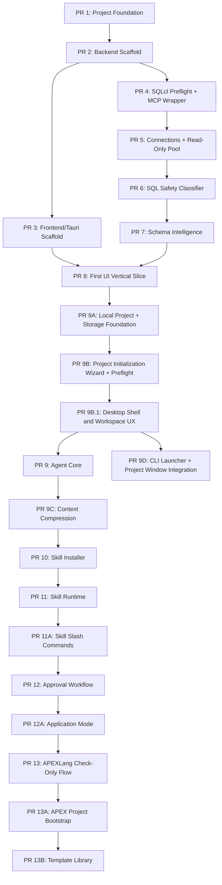

# Apex Pilot PR Roadmap

This note captures the updated PR split plan after completing PR 8 and reviewing storage, project setup, agent memory, APEXLang, and application-mode decisions.

## Current State

- PR 8 is complete.
- PR 9B (Project Initialization Wizard + Preflight) is complete and merged: wizard/preflight APIs plus interim UI.
- Next is PR 9B.1 (Desktop Shell & Workspace UX): in progress on `pr9b.1-desktop-shell-ux`. It owns the redesign. See [[Apex Pilot Desktop UX]].
- Remaining PR 9+ addendum work is still plannable around that sequence.
- Existing completed PR numbers should stay stable.
- New work should use lettered addendum PRs rather than renumbering completed history.

## Updated PR Dependency Map

## Locked Decisions

- Phase 1 remains local-first with SQLite storage.
- Use a committed JSON project manifest, initially `apex-pilot.json`.
- Store portable project facts in the manifest and private/user/runtime facts in local SQLite.
- Store logical project environments in the manifest; map them locally to SQLcl saved connection names.
- Support local user profiles in phase 1.
- Use a random local profile ID plus a stable salted hash of email and username for duplicate detection.
- If the same email and username are entered again, detect it and ask whether to reuse the existing profile or create a separate profile with a different display name.
- Let users choose the chat/tool retention policy during setup.
- Display chat history from the latest message backward in 2-week windows, with load-older increments.
- Persist chat, prompts, responses, SQL text, classification, approval metadata, and tool logs.
- Do not persist SQL result rows by default.
- Use SQLite core tables and FTS5 for phase 1 search.
- Defer vector memory to a later optional adapter.
- Keep Python at `>=3.12` until a concrete dependency requires a bump.
- Support remote Git clone in the project wizard through the installed Git client only.
- Do not store Git credentials. Use system Git, OS credential helpers, and SSH agent behavior.
- Guide users through missing prerequisites in phase 1; do not auto-install dependencies from the app.
- Keep core SQLcl MCP support at SQLcl 25.2+.
- Gate APEXLang features on detected SQLcl command support.
- Keep Oracle Database storage/vector memory as a phase 2 research and ADR topic.
- First Agent Core natural-language SQL execution is read-only only.
- Give the agent bounded on-demand memory search, not automatic retrieval on every turn.
- Add Application Mode after the approval workflow.
- Application Mode must not auto-approve destructive DDL.
- Keep GUI project open/new/recent flows in the desktop app and add a VS Code-style CLI launcher after the project wizard.
- PR 9B is merged (wizard/preflight APIs and interim UI); the desktop shell/workspace redesign is PR 9B.1 (planned, not started). Details in [[Apex Pilot Desktop UX]].
- Dependency order: PR 9B → PR 9B.1 → then Agent Core / PR 9D. PR 9B.1 should land before heavy Agent Core UI reliance.

## Near-Term Addendum PRs

### PR 9A: Local Project + Storage Foundation

Purpose: establish the local persistence and manifest boundary before Agent Core.

Scope:
- SQLite migrations and storage primitives.
- Local profiles.
- Projects and project manifests.
- Logical environment mappings.
- Chat threads/messages and tool activity metadata.
- FTS5-backed keyword search for project memory.
- Runtime checks for SQLite JSON and FTS5.
- Retention policy foundation.
- No persisted SQL result rows by default.

### PR 9B: Project Initialization Wizard + Preflight

Status: complete / merged (wizard/preflight APIs + interim UI).

Purpose: let users create/open projects and verify prerequisites before agent work.

Scope:
- Desktop project menu actions for New Project, Open Project, Open Recent, Close Project, and Settings.
- Existing local repo/path import.
- Remote SSH/HTTPS clone through installed Git only; no stored Git credentials.
- New project creation with optional Git init and README.
- Preflight / first-launch checks for Git, SQLcl, Java/JRE, Python, SQLcl MCP smoke test, and manifest load.
- Guided prerequisite installation instructions, not app-run installers or auto-install.
- Retention policy selection.
- Local logical environment → SQLcl saved connection mapping, plus optional APEX workspace mapping.
- Ships an interim UI only; the dense IDE shell redesign is owned by PR 9B.1.

### PR 9B.1: Desktop Shell & Workspace UX

Status: in progress (branch `pr9b.1-desktop-shell-ux`).

Purpose: replace the interim project UI with the locked dense IDE shell and workspace UX before Agent Core leans on the desktop surface.

Scope:
- Startup funnel: silent health check → full preflight if first-time/unhealthy → profile if needed → recent-projects picker → workspace.
- Always-on menus and bottom status bar; left/right panes only when a project is open.
- Left project file tree (junk hidden by default); center chat with real composer (send disabled until Agent Core); right shared tab strip for schema/files/SQL sheets with dockable tools.
- Profile-remembered tool prefs/widths; project-remembered open tabs.
- Schema tree, SQL sheet, MCP Activity floating window, close-project → picker, one project per window.
- Native folder pickers primary; Tauri FS for files; backend for MCP/metadata.
- Visual direction: IDE chrome, not stacked cards.

Locked details: [[Apex Pilot Desktop UX]].

### PR 9D: CLI Launcher + Project Window Integration

Purpose: let developer users jump from a terminal into an Apex Pilot project without weakening the normal desktop project lifecycle.

Depends on: PR 9B.1 (shell/window model should be in place before heavy CLI/window integration).

Scope:
- Packaged CLI command such as `apex-pilot .` and `apex-pilot <path-to-project-or-repo>`.
- Resolve folders by detecting `apex-pilot.json`.
- Launch project initialization when a folder is not yet an Apex Pilot project.
- Define one-project-per-window behavior.
- Open a new window for different projects when supported, otherwise prompt before replacing the current project.
- Preserve normal preflight, manifest validation, and connection-selection flows.
- Do not run Git commands or database work just because a folder was opened.

### PR 9: Agent Core

Purpose: introduce PydanticAI orchestration behind guarded facades.

Scope changes from the original plan:
- Depends on PR 9B and should follow PR 9B.1 so Agent Core UI can rely on the redesigned shell.
- Adds a guarded project memory search facade.
- First natural-language SQL execution is read-only only.
- Memory search is bounded and on-demand.

### PR 9C: Context Compression

Purpose: reduce long-running chat context pressure without provider lock-in.

Scope:
- Provider-agnostic summaries.
- Store summaries locally.
- Tie summaries to project, profile, thread, model profile, and source message window.
- Respect retention policy.

## Later Addendum PRs

### PR 11A: Skill Slash Commands

Add visible slash-command parsing, discovery, and invocation through the guarded skill execution facade.

### PR 12A: Application Mode

Add a project/profile mode that reduces prompts for low-risk actions, while still requiring approval for destructive DDL, security-sensitive SQL, risky SQLcl commands, and APEX import.

### PR 13A: APEX Project Bootstrap

Use SQLcl APEXLang generation or minimal bundled starter templates to create starter APEXLang artifacts. Validate before import and require approval for import.

### PR 13B: Template Library

Add global and project-level template management after the minimal bootstrap path works.

## Research Notes

- SQLite is enough for phase 1 local metadata, chat history, and keyword memory search.
- SQLite JSON support is built into modern SQLite; the app should still check runtime capability.
- FTS5 is suitable for phase 1 search and should also be checked at runtime.
- `sqlite-vec` is the current lightweight successor to `sqlite-vss`, but it is still best treated as an optional later adapter.
- Oracle AI Vector Search and `python-oracledb` vector support are real options for phase 2 shared/enterprise storage, but adding direct Oracle driver storage now would require a deliberate ADR because current execution invariants route database work through SQLcl MCP only.
- SQLcl APEXLang support includes lifecycle commands such as generate, validate, export, and import in newer SQLcl/APEX documentation.
- Core SQLcl support should remain at SQLcl 25.2+ while APEXLang features are enabled only when command support is detected.

## Related

[[Apex Pilot]]
[[Apex Pilot Desktop UX]]
[[Oracle]]
[[Oracle APEX]]
[[SQLcl]]
[[SQLite]]
[[PydanticAI]]
[[Agent Skills]]
